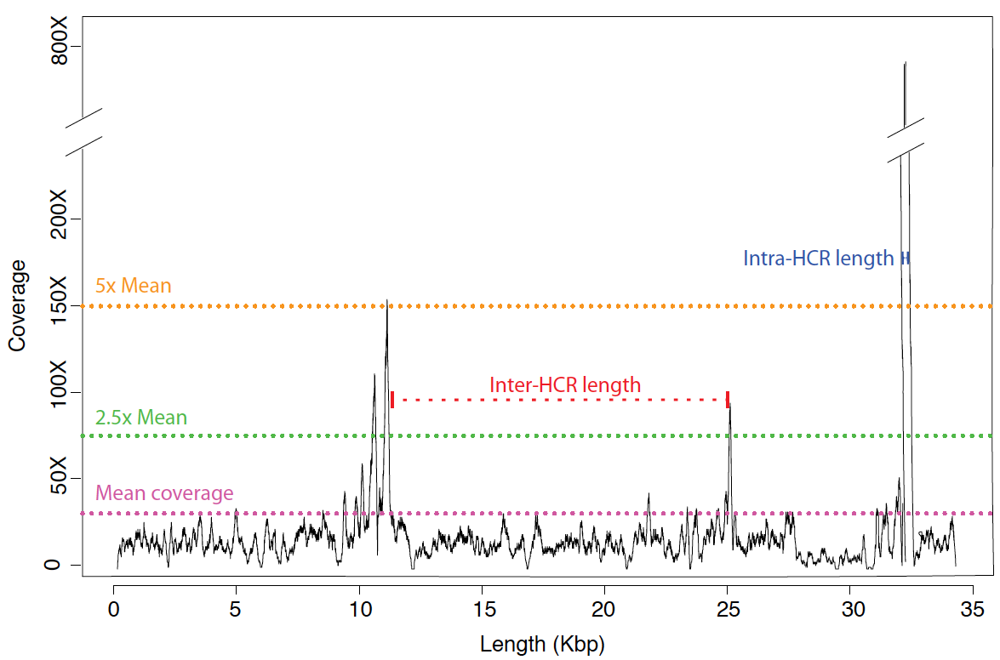
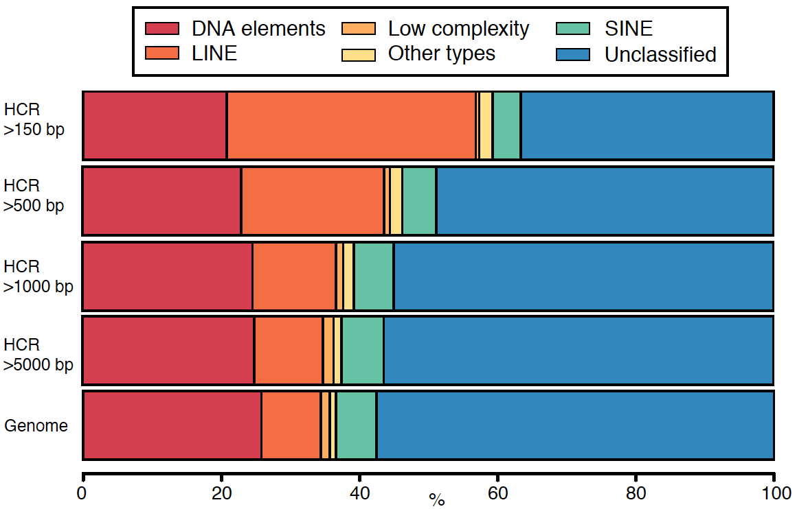
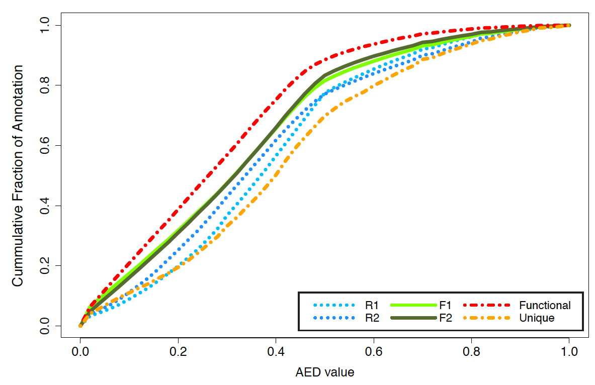
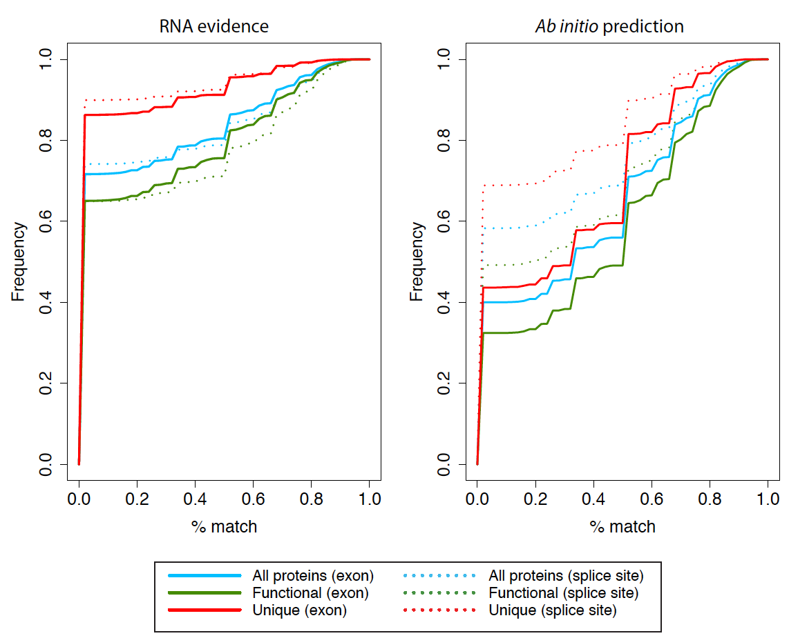

# Introduction
This is a small git repository of the scripts we used in the genome assembly, annotation and comparative analysis of the Dysdera silvatica genome prokect.

We include several scripts in perl, python or R. Some scripts might need additional perl/python/R modules in order to execute that we have not included here.

In some cases we include additional information within each script according the parameters employed or the data we used. All necessary files to reproduce results are included as supplementary information deposited in the GigaDB repository (link) in the paper associated to this publication.

# Citation
"The draft genome sequence of the spider Dysdera silvatica (Araneae, Dysderidae): A valuable resource for functional and evolutionary genomic studies in chelicerates" Sánchez-Herrero J. F., Frías-López C., Escuer P., Hinojosa-Alvarez S., Arnedo M.A., Sánchez-Gracia A., Rozas J. [to add DOI and citation]

# License

MIT License

Copyright (c) 2019 Evolutionary Genomics & Bioinformatics 

Permission is hereby granted, free of charge, to any person obtaining a copy
of this software and associated documentation files (the "Software"), to deal
in the Software without restriction, including without limitation the rights
to use, copy, modify, merge, publish, distribute, sublicense, and/or sell
copies of the Software, and to permit persons to whom the Software is
furnished to do so, subject to the following conditions:

The above copyright notice and this permission notice shall be included in all
copies or substantial portions of the Software.

THE SOFTWARE IS PROVIDED "AS IS", WITHOUT WARRANTY OF ANY KIND, EXPRESS OR
IMPLIED, INCLUDING BUT NOT LIMITED TO THE WARRANTIES OF MERCHANTABILITY,
FITNESS FOR A PARTICULAR PURPOSE AND NONINFRINGEMENT. IN NO EVENT SHALL THE
AUTHORS OR COPYRIGHT HOLDERS BE LIABLE FOR ANY CLAIM, DAMAGES OR OTHER
LIABILITY, WHETHER IN AN ACTION OF CONTRACT, TORT OR OTHERWISE, ARISING FROM,
OUT OF OR IN CONNECTION WITH THE SOFTWARE OR THE USE OR OTHER DEALINGS IN THE
SOFTWARE.


# Documentation

Some of this scripts are small and basic scripts that we basically collect here for the shake of reproducibility. Some others might contain more detailed algorithms. We briefly add a small piece of information on each one in the context of the process it was employed.

## Sequence manipulation

### contig_stats.pl

It generates contig statistics and metrics from a given assembly. 

    bash$ perl ./Dysdera_silvatica_genome/perl/contig_stats.pl

     Usage: please provide a single fasta file for Contig Statistics...
     perl perl/contig_stats.pl fasta_file

Notes:
- Sequences < 150pb would discarded for the statistics...
- Statistics are provided for different sets of sequences
- Default splitting sets: 150, 500, 1000, 5000, 10000
- Provide new parts using a csv argument for the script

      e.g. bash$perl ./Dysdera_silvatica_genome/perl/contig_stats.pl fasta_file 1000,15000

### get-long-contigs.pl & get-short-contigs.pl

Both scripts subset a given assembly fasta file selecting contigs bigger or smaller than the size selected.

     e.g. bash$ perl ./Dysdera_silvatica_genome/perl/get-long-contigs.pl assembly_file.fasta 10000
     e.g. bash$ perl ./Dysdera_silvatica_genome/perl/get-short-contigs.pl assembly_file.fasta 500

### get-size-contigs.pl


## Download NCBI reference genomes

### NCBI_downloader.pl

We downloaded a set of sequences from NCBI in order to perform a quality and contaminant search. 

Following instructions available at NCBI data ftp://ftp.ncbi.nlm.nih.gov/pub/factsheets/HowTo_Downloading_Genomic_Data.pdf

We followed the next steps: 

1. 	Check assembly summary files from the RefSeq ftp site (/refseq/*/assembly_summary.txt) of the taxa of interest.

`````
Archaea: ftp://ftp.ncbi.nlm.nih.gov/genomes/refseq/archaea/assembly_summary.txt
Protozoa: ftp://ftp.ncbi.nlm.nih.gov/genomes/refseq/protozoa/assembly_summary.txt
Virus: ftp://ftp.ncbi.nlm.nih.gov/genomes/refseq/viral/assembly_summary.txt
Bacteria: ftp://ftp.ncbi.nlm.nih.gov/genomes/refseq/bacteria/assembly_summary.txt
Fungi:ftp://ftp.ncbi.nlm.nih.gov/genomes/refseq/fungi/assembly_summary.txt
`````

e.g. refseq/bacteria/assembly_summary.txt
`````
#   See ftp://ftp.ncbi.nlm.nih.gov/genomes/README_assembly_summary.txt for a description of the columns in this file.
# assembly_accession    bioproject      biosample       wgs_master      refseq_category taxid   species_taxid   organism_name   infraspecific_name      isolate version_status  assembly_level  release_type    genome_rep      seq_rel_date    asm_name        submitter       gbrs_paired_asm paired_asm_comp ftp_path        excluded_from_refseq    relation_to_type_material
GCF_000010525.1 PRJNA224116     SAMD00060925            representative genome   438753  7       Azorhizobium caulinodans ORS 571        strain=ORS 571          latest  Complete Genome Major   Full    2007/10/16      ASM1052v1       University of Tokyo     GCA_000010525.1 identical       ftp://ftp.ncbi.nlm.nih.gov/genomes/all/GCF/000/010/525/GCF_000010525.1_ASM1052v1                assembly from type material
GCF_000007365.1 PRJNA224116     SAMN02604269            representative genome   198804  9       Buchnera aphidicola str. Sg (Schizaphis graminum)       strain=Sg               latest  Complete Genome Major   Full    2002/07/02      ASM736v1        Uppsala Univ.   GCA_000007365.1 identical       ftp://ftp.ncbi.nlm.nih.gov/genomes/all/GCF/000/007/365/GCF_000007365.1_ASM736v1         
GCF_000007725.1 PRJNA224116     SAMN02604289            representative genome   224915  9       Buchnera aphidicola str. Bp (Baizongia pistaciae)       strain=Bp (Baizongia pistaciae)         latest  Complete Genome Major   Full    2003/01/29      ASM772v1        Valencia Univ.  GCA_000007725.1 identical       ftp://ftp.ncbi.nlm.nih.gov/genomes/all/GCF/000/007/725/GCF_000007725.1_ASM772v1         
`````


2. 	Use the NCBI_downloader.pl script to download the data file for each FTP path.
      
        bash$ perl ./Dysdera_silvatica_genome/perl/NCBI_downloader.pl 
        
        Usage: perl ./Dysdera_silvatica_genome/perl/NCBI_downloader.pl -file file -n cpus -genome|-genbank|-gff [-summary]
      	
        - file: contains name,ftp site	      
        - summary: flag indicating multiple genomes to download

There are two possibilities here. 

1) Summary option. 

We can provide names of groups and path to assembly_summary ftp sites. The scripts downloads all the genomes available:

For example: Bacteria & Virus. Provide a csv file like:
        
        e.g. bash$ cat test.csv
        Virus,ftp://ftp.ncbi.nlm.nih.gov/genomes/refseq/viral/assembly_summary.txt
        Bacteria,ftp://ftp.ncbi.nlm.nih.gov/genomes/refseq/bacteria/assembly_summary.txt

Execute NCBI_downloader.pl to download genome information from each strain and using 3 threads. It would initially download the assembly summary file to then retrieve each entry.

        e.g. bash$ perl ./Dysdera_silvatica_genome/perl/NCBI_downloader.pl -file test.csv -summary -n 3 -genome

`````
+ Download file: ftp://ftp.ncbi.nlm.nih.gov/genomes/refseq/bacteria/assembly_summary.txt
--2019-07-08 20:02:55--  ftp://ftp.ncbi.nlm.nih.gov/genomes/refseq/bacteria/assembly_summary.txt
          => “assembly_summary.txt”
Resolviendo ftp.ncbi.nlm.nih.gov (ftp.ncbi.nlm.nih.gov)... 130.14.250.11, 2607:f220:41e:250::10
Conectando con ftp.ncbi.nlm.nih.gov (ftp.ncbi.nlm.nih.gov)[130.14.250.11]:21... conectado.
Identificándose como anonymous ... ¡Dentro!
==> SYST ... hecho.   ==> PWD ... hecho.
==> TYPE I ... hecho.  ==> CWD (1) /genomes/refseq/bacteria ... hecho.
==> SIZE assembly_summary.txt ... 48346044
==> PASV ... hecho.   ==> RETR assembly_summary.txt ... hecho.
assembly_summary.txt                                                         10%[=================>                                                                                                                                                                         ]   4,67M   434KB/s   eta 2m 16s
.......

** Downloading data for Acetobacter aceti
Acetobacter aceti --> ftp://ftp.ncbi.nlm.nih.gov/genomes/all/GCF/002/005/445/GCF_002005445.1_ASM200544v1/GCF_002005445.1_ASM200544v1_genomic.fna.gz
+ Download file: ftp://ftp.ncbi.nlm.nih.gov/genomes/all/GCF/002/005/445/GCF_002005445.1_ASM200544v1/GCF_002005445.1_ASM200544v1_genomic.fna.gz
....
** Downloading data for Chryseobacterium indologenes
Chryseobacterium indologenes --> ftp://ftp.ncbi.nlm.nih.gov/genomes/all/GCF/002/025/665/GCF_002025665.1_ASM202566v1/GCF_002025665.1_ASM202566v1_genomic.fna.gz
+ Download file: ftp://ftp.ncbi.nlm.nih.gov/genomes/all/GCF/002/025/665/GCF_002025665.1_ASM202566v1/GCF_002025665.1_ASM202566v1_genomic.fna.gz
....
** Downloading data for Xanthomonas oryzae pv. oryzae PXO99A
Xanthomonas oryzae pv. oryzae PXO99A --> ftp://ftp.ncbi.nlm.nih.gov/genomes/all/GCF/000/019/585/GCF_000019585.2_ASM1958v2/GCF_000019585.2_ASM1958v2_genomic.fna.gz
.......

`````

This script would take some time to download all the information requested. 

2) Provide some examples: name and ftp site in a csv file

        e.g. bash$ cat example.csv
        GCF_000010525.1,ftp://ftp.ncbi.nlm.nih.gov/genomes/all/GCF/000/010/525/GCF_000010525.1_ASM1052v1
        GCF_000007365.1,ftp://ftp.ncbi.nlm.nih.gov/genomes/all/GCF/000/007/365/GCF_000007365.1_ASM736v1         
        GCF_000007725.1,ftp://ftp.ncbi.nlm.nih.gov/genomes/all/GCF/000/007/725/GCF_000007725.1_ASM772v1         

Command:

    e.g. bash$ perl ./Dysdera_silvatica_genome/perl/NCBI_downloader.pl -file example.csv -n 3 -genome

This script would take some time according to the amount of samples provided.

## High Coverage Regions (HCR)

### high_coverage_islands.pl

This script generates information regarding high-coverage regions. Given a mean coverage and contig lengths, it determines regions with a high coverage and fulfilling different length and deviation from the coverage mean cutoffs. 	

See additional information in the paper cited.

This image is an example plot generated where the coverage per base pair is shown in black and mean coverage is shown as a purple dot line. In green and orange dot lines, we plotted 2.5-5 times the average coverage cutoff. In blue we showed the intra gap length and in red the inter-repeat gap length. [Click image to see details].



Usage:

    bash$ perl ./Dysdera_silvatica_genome/perl/high_coverage_islands.pl \
    mean_coverage coverage_file length_cutoff output_file CPu   \
    intra_gap_cutoff length_file coverage_cutoff

Notes:

- **coverage_file** is a coverage file generated using samtools from sort indexed bam file. It must include positions with 0 values if any

```
sequence_6091	1	0
sequence_6091	2	0
sequence_6091	3	0
sequence_6091	4	0
sequence_6091	5	0
sequence_6091	6	0
sequence_6091	7	0
sequence_6091	8	0
sequence_6091	9	1
sequence_6091	10	1
sequence_6091	11	1
sequence_6091	12	1
sequence_6091	13	1
sequence_6091	14	1
sequence_6091	15	1
sequence_6091	16	2
sequence_6091	17	2
...
sequence_6091	2658	57
sequence_6091	2659	62
sequence_6091	2660	63
sequence_6091	2661	63
sequence_6091	2662	65
...
sequence_6091	24649	12
sequence_6091	24650	12
sequence_6091	24651	11
sequence_6091	24652	9
sequence_6091	24653	9
sequence_6091	24654	9
sequence_6091	24655	8
sequence_6091	24656	8
sequence_6091	24657	8
sequence_6091	24658	8
sequence_6091	24659	7
`````

(Previous image was generated using the R script [Plot_Example_HighCoveraIsland.R](https://github.com/molevol-ub/Dysdera_silvatica_genome/blob/master/R_scripts/Plot_Example_HighCoveraIsland.R) and a coverage file information for a selected contig.)

- To obtain the **mean coverage** you can do: 
        
        awk '{ sum +=$3; n++ } END { if (n > 0) print sum / n; }' coverage_file.txt

- **length_cutoff**: Minimun length cutoff for contig sequences. e.g. 30000

- **intra_gap_cutoff**: Inter-HCR minimum length. it can be a single value or comma separated values: 50 or 50,100,500

- **length_file**: For each contig, provide the sequence length. To do so, we will employ the script add it here named: [get-size-contigs.pl](perl/get-size-contigs.pl)

        bash$ perl ./Dysdera_silvatica_genome/perl/get-size-contigs.pl contigs.fasta

- **coverage_cutoff**: The amount of times to increase the mean coverage to consider it over the the threshold. e.g. 2.5, 5, 10...


This high_coverage_islands.pl script generates this output. For additional details, check supplementary files and information in the original paper:

```
sequence_10003  150     24752   4       repeat_1        -       -       -       6338    6508    170
sequence_10003  150     24752   4       repeat_2        6509    11083   4574    11084   11776   692
sequence_10003  150     24752   4       repeat_3        11777   20259   8482    20260   21098   838
sequence_10003  150     24752   4       repeat_4        21099   22039   940     22040   22497   457
sequence_10003  500     24752   2       repeat_1        -       -       -       11084   11776   692
sequence_10003  500     24752   2       repeat_2        11777   20259   8482    20260   21098   838
sequence_10005  10      13790   4       repeat_1        -       -       -       9668    10197   529
sequence_10005  10      13790   4       repeat_2        10198   10335   137     10336   11212   876
sequence_10005  10      13790   4       repeat_3        11213   11250   37      11251   11749   498
sequence_10005  10      13790   4       repeat_4        11750   13191   1441    13192   13270   78
sequence_10005  150     13790   3       repeat_1        -       -       -       9668    10197   529
sequence_10005  150     13790   3       repeat_2        10198   10335   137     10336   11212   876
sequence_10005  150     13790   3       repeat_3        11213   11250   37      11251   11749   498
sequence_10005  500     13790   2       repeat_1        -       -       -       9668    10197   529
sequence_10005  500     13790   2       repeat_2        10198   10335   137     10336   11212   876
sequence_10011  10      14044   2       repeat_1        -       -       -       7090    7175    85
sequence_10011  10      14044   2       repeat_2        7176    7657    481     7658    7782    124
sequence_10011  150     14044   1       repeat_1        -       -       -       8016    8201    185
sequence_10010  10      12713   2       repeat_1        -       -       -       449     1347    898
sequence_10010  10      12713   2       repeat_2        1348    1359    11      1360    1372    12
sequence_10010  150     12713   2       repeat_1        -       -       -       449     1347    898
sequence_10010  150     12713   2       repeat_2        1348    1484    136     1485    1715    230
sequence_10010  500     12713   1       repeat_1        -       -       -       449     1347    898
```

### high_coverage_islands2bed.pl

This script converts outfile from high_coverage_islands.pl into bed format for further analysis and intersection of annotation with the structural and functional annotation.

    bash$ perl ./Dysdera_silvatica_genome/perl/high_coverage_islands2bed.pl 
    
    Usage:
    perl ./Dysdera_silvatica_genome/perl/high_coverage_islands2bed.pl HCI_out_file name


    e.g. perl ./Dysdera_silvatica_genome/perl/high_coverage_islands2bed.pl subset_10kb.scaffolds_2.5x_coverage.HCI_5000.txt HCI_5000.bed
    
Using Bedtools we would intersect the annotation of the HCR regions with functional, structural or repeat annotation. 

    bedtools intersect -wao -a HCI_5000.bed -b Dsil_repeatMasker.bed > intersection_annotation.bed

In order to convert repeatmasker annotation into bed format, we developed and script included here and named as [repeatMasker2bed.py](https://github.com/molevol-ub/Dysdera_silvatica_genome/blob/master/python/repeatMasker2bed.py)

    bash$ python ./Dysdera_silvatica_genome/python/repeatMasker2bed.py

Finally, once we have collected the amount of repeats in the whole population and in the subset, we analyzed if they were significantly different using the cumulative distribution function under a [hipergeometric distribution](https://en.wikipedia.org/wiki/Hypergeometric_distribution). Credit to [Damian Kao](https://www.biostars.org/p/66729/)

We analyzed several intra repreat cutoff and coverage cutoff and we generated a bash script, [HCR_commands.sh](https://github.com/molevol-ub/Dysdera_silvatica_genome/blob/master/bash/HCR_commands.sh), to automatize the process.

Finally, we plotted results using different R scripts:
- [Plot_HCR_length.R](https://github.com/molevol-ub/Dysdera_silvatica_genome/blob/master/R_scripts/Plot_HCR_length.R): to plot intra and inter gap length distribution for each set.

- [bar_plot_HCR.R](https://github.com/molevol-ub/Dysdera_silvatica_genome/blob/master/R_scripts/bar_plot_HCR.R): to plot annotation of repeats for each set.




## Taxonomy profile    

### get_taxonomy_IDs.pl
[TO DO...]

### taxonomy_parser.pl
[TO DO...]


## Coverage distribution

## Annotation statistics

Annotation statistics provided by Maker were plot after each annotation, training and final round, to check the quality of the annotation generated.

AED statistics were plot for each annotation round using the R script [AED_statistics_plot.R](https://github.com/molevol-ub/Dysdera_silvatica_genome/blob/master/R_scripts/AED_statistics_plot.R)



The quality index provided by maker was plot also for different sets using the R script [QI_data.R](https://github.com/molevol-ub/Dysdera_silvatica_genome/blob/master/R_scripts/QI_data.R)




